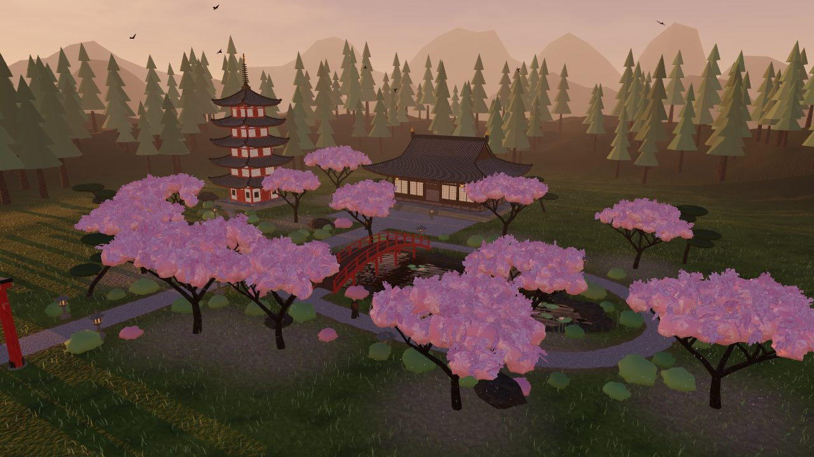
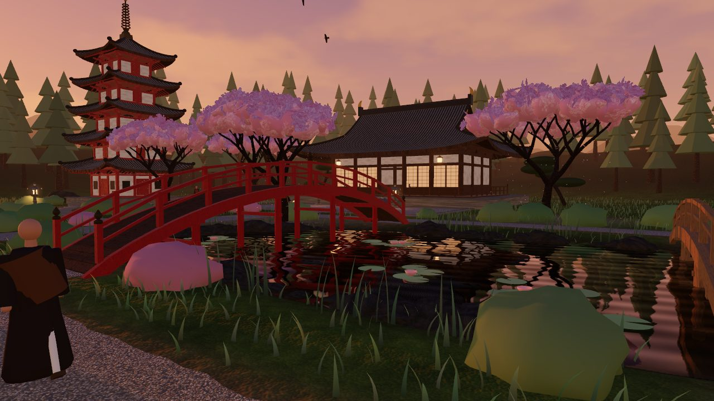
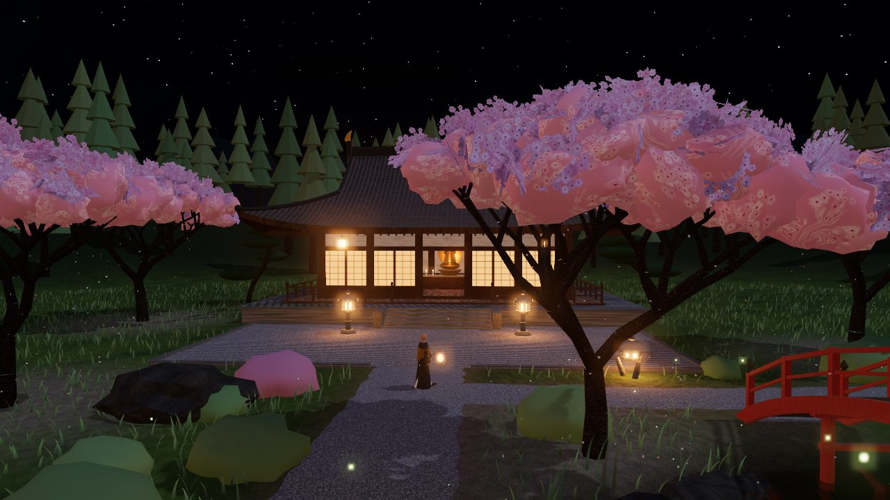
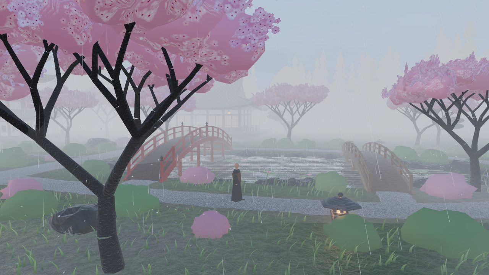

# Sakura Temple Garden

An interactive, fully procedural 3D Japanese temple complex built with
[three.js](https://threejs.org). There are no model or texture downloads:
all geometry and textures are generated in code when the page loads.



| Dusk by the pond | Night | Rain |
| --- | --- | --- |
|  |  |  |

## Running it

The project has no build step. It uses native ES modules and an import map
that loads three.js r170 from jsDelivr. Serve the folder over HTTP (ES
modules don't load from `file://`):

```bash
npm start            # npx http-server on http://localhost:8080
# or
python3 -m http.server 8080
```

Quality is picked automatically: desktops and laptops get `high`, phones
and tablets get `low`. Change it with the **Quality** selector in the panel;
the choice is remembered in this browser. You can also add
`?quality=low|medium|high` or `#low` / `#medium` / `#high` to the URL.

## What's in the scene

| Area | Details |
| --- | --- |
| **Main hall** | Stone podium and steps, raised veranda with railings, timber frame with stacked bracket sets, shōji doors that glow at night, an open centre bay onto a candle-lit altar with a gilded Buddha, and a curved **irimoya** roof with upturned corners, exposed rafters, ridge tiles and golden shibi |
| **Pagoda** | Five storeys, each with its own deep curved roof, brackets and rafters. It has a bronze sōrin spire and wind bells that swing at the roof corners |
| **Torii** | A vermilion myōjin gate with upswept lintels at the entrance |
| **Koi pond** | Planar reflections plus a refraction pre-pass, depth-based absorption, Fresnel, wind waves, rain-drop rings, and ripple rings from koi jumps. It also has lily pads, lotus flowers and edge rocks |
| **Bridges** | A tall vermilion drum bridge and a lower cedar bridge. Monks walk over both |
| **Lanterns** | Kasuga- and yukimi-dōrō with emissive fire boxes, glow halos and real point lights that flicker |
| **Paths** | Gravel ribbons that follow the terrain, stepping stones to the pagoda, and a raked-gravel forecourt |
| **Sakura** | Recursively branching cherry trees with instanced blossom volumes and cards that sway in the wind |
| **Petals** | Thousands of individually simulated petals. They drift on the wind and tumble as they fall, then settle on the ground or float on the pond |
| **Life** | Three monks with walk cycles on looping routes, koi schools (boids) with tail undulation and occasional leaps, a bird flock that roosts at night, and fireflies after dusk |
| **Nature** | Wind-driven instanced grass with pond reeds, cloud-pruned pines, azalea mounds, a cedar forest and distant mountains |

## Atmosphere

* **Day cycle.** Time starts in the late afternoon, so the default view is
  sunset turning into dusk and then night, and the clock keeps running
  through the next day. Sun elevation drives the sky gradient, the sun's
  colour temperature (Kelvin → RGB, from ~1700 K at the horizon to 5800 K
  at noon), light intensities, stars, the moon, exposure, and the lantern
  and window glow.
* **Weather.** Clear, rain and fog blend smoothly over several seconds. An
  optional auto mode changes the weather every minute or two.
  * Rain adds GPU rain streaks, ripples on the pond, overcast skies, wet
    and glossy materials, stronger wind and heavier petal fall.
  * Fog adds exponential fog, horizon haze in the sky shader, drifting
    low mist sprites and bigger lantern halos.
* **Lighting.** Physically based rendering: MeshStandardMaterial, ACES
  tone mapping and an environment map rebuilt (PMREM) from the sky shader.
  A single shadow-casting light acts as the sun by day and the moon by
  night, using PCF soft shadows, plus hemisphere fill light and bloom.

## Controls

| Input | Action |
| --- | --- |
| Drag / right-drag / scroll | Orbit / pan / zoom (touch: 1 finger / 2 fingers / pinch) |
| `W` `A` `S` `D` | Pan |
| `Space` | Play / pause time |
| `[` `]` | Scrub time by 15 minutes |
| `1` `2` `3` `4` | Clear / rain / fog / automatic weather |
| `R` | Reset camera |
| `H` | Hide the UI |

The panel also has a time-of-day slider, time speed, quick jumps
(sunset / night / day), weather buttons and toggles for shadows and bloom.

## Project layout

```
index.html              import map, loader & error overlays
styles.css              UI styling
src/
  main.js               WebGL check → lazy-loads the app, reports failures
  app/
    App.js              builds the world in steps, runs the frame loop
    WebGLSupport.js     capability detection (runs before three.js loads)
    quality.js          low / medium / high presets
  core/
    Renderer.js         WebGLRenderer, shadows, EffectComposer + bloom
    CameraRig.js        OrbitControls with ground/bounds limits
  materials/
    textures.js         canvas-painted textures + derived normal maps
    MaterialLibrary.js  shared PBR materials, rain "wetness"
  atmosphere/
    DayCycle.js         time → sun/moon, sky palette, Kelvin, intensities
    Sky.js              sky-dome shader (sun, moon, stars, clouds) + env map
    Lighting.js         sun/moon shadow light, hemisphere light, fog, exposure
    Weather.js          clear / rain / fog state machine, wind
    Precipitation.js    GPU rain streaks and mist sprites
  world/
    layout.js           world plan: positions, pond SDF, heights, paths
    Terrain.js          heightfield, vertex colouring, mountains
    Paths.js            gravel ribbons, stepping stones, raked forecourt
    roof.js             curved hip / irimoya roof generator
    Temple.js           main hall
    Pagoda.js           five-storey pagoda
    Torii.js            entrance gate
    Bridge.js           arched bridges
    Lanterns.js         stone lanterns + point lights
    Pond.js             water shader, refraction pass, lily pads, rocks
    rocks.js            boulder geometry
  nature/
    wind.js             shared wind uniforms + GLSL + CPU sampler
    Grass.js            chunked, LOD'd instanced grass & reeds
    SakuraTrees.js      procedural cherry trees
    Petals.js           falling-petal simulation
    Forest.js           cedars, pines, shrubs, feature rocks
  life/
    Koi.js              schooling koi, jumps, splash particles
    Monks.js            walking monks
    Birds.js            flock
    Fireflies.js        GPU fireflies
  ui/
    ControlPanel.js     time / weather / rendering controls
    Overlay.js          loading + error screens
  utils/                RNG, simplex noise, math, colour, geometry batching
```

## Performance notes

* **Instancing** is used for grass (split into 10 m chunks for frustum
  culling), blossoms, petals, rocks, trees, shrubs, stepping stones and lily
  pads.
* **LOD.** Grass chunks draw fewer blades with distance.
* **Adaptive resolution.** On HiDPI screens, if the frame rate stays low,
  the extra supersampling is trimmed (never below native resolution) and
  grass thins slightly. Both recover when there's headroom.
* **Static architecture** is merged per material (`GeometryBatcher`), so a
  building is a handful of draw calls.
* **Water passes.** The mirror and refraction passes run at reduced
  resolution. They skip objects that can't be seen in them, such as grass
  and rain in the reflection, and anything above water in the refraction.
* **Lights** stay in the scene with zero intensity by day, so switching
  between day and night never triggers shader recompiles.

## Fallbacks

* No WebGL 2 → a friendly explanation instead of a blank page.
* three.js fails to download → a message about connectivity and serving
  over http.
* Browser without module / import-map support → a watchdog message after
  20 s.
* WebGL context lost at runtime → an overlay that asks you to reload.
